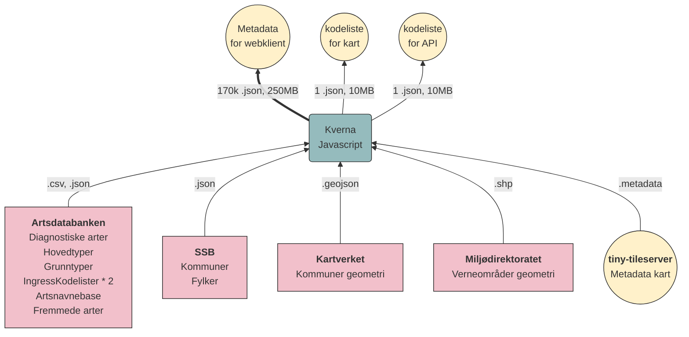
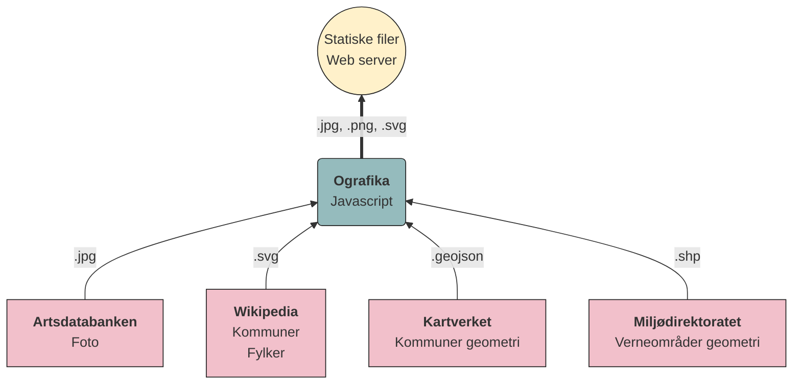
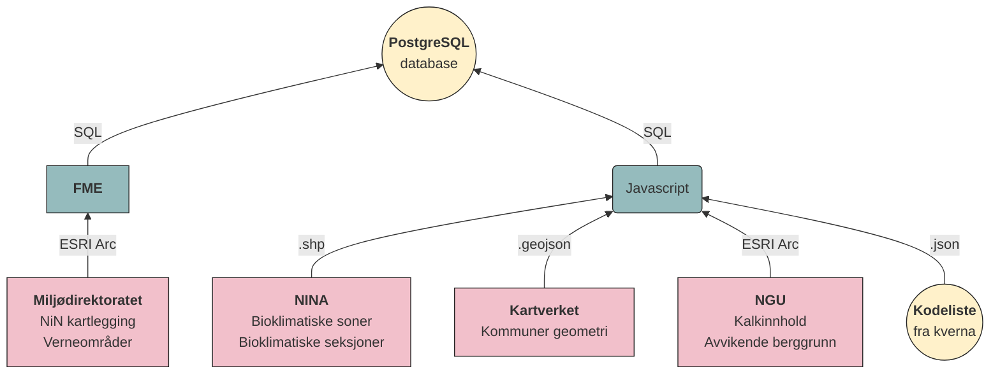
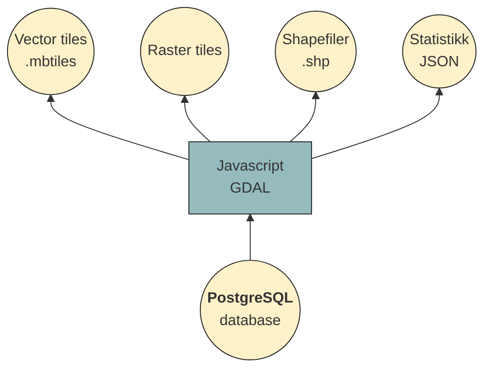

# Dataflyt

## Lastejobb for metadata

```mermaid
graph BT
    adb[<b>Artsdatabanken</b><br/>Diagnostiske arter<br/>Hovedtyper<br/>Grunntyper<br/>IngressKodelister * 2<br/>Artsnavnebase<br/>Fremmede arter]-->|.csv, .json|kverna
    ssb[<b>SSB</b><br/>Kommuner<br/>Fylker]-->|.json|kverna
    kv[<b>Kartverket</b><br/>Kommuner geometri]-->|.geojson|kverna
    md[<b>Miljødirektoratet</b><br/>Verneområder geometri]-->|.shp|kverna
    tileserver((<b>tiny-tileserver</b><br>Metadata kart))-->|.metadata|kverna
    kverna(Kverna<br/>Javascript)==>|170k .json, 250MB|db((Metadata<br/>for webklient));
    kverna(Kverna<br/>Javascript)-->|1 .json, 10MB|post((kodeliste<br/>for kart));
    kverna(Kverna<br/>Javascript)-->|1 .json, 10MB|api((kodeliste<br/>for API));

     classDef out fill:#FFF1CA,stroke:#222,stroke-width:1px;
     classDef middle fill:#95BBBD,stroke:#222,stroke-width:1px;
     classDef in fill:#F2C0CB,stroke:#222,stroke-width:1px;
     class tileserver,db,post,api out
     class adb,md,ssb,kv in
     class kverna middle
```

## Lastejobb for grafisk innhold

```mermaid
graph BT
    adb[<b>Artsdatabanken</b><br/>Foto]-->|.jpg|kverna
    wikipedia[<b>Wikipedia</b><br/>Kommuner<br/>Fylker]-->|.svg|kverna
    kv[<b>Kartverket</b><br/>Kommuner geometri]-->|.geojson|kverna
    md[<b>Miljødirektoratet</b><br />Verneområder geometri]-->|.shp|kverna
    kverna(<b>Ografika</b><br/>Javascript)==>|.jpg, .png, .svg|db((Statiske filer<br/>Web server));
     classDef out fill:#FFF1CA,stroke:#222,stroke-width:1px;
     classDef in fill:#F2C0CB,stroke:#222,stroke-width:1px;
     classDef middle fill:#95BBBD,stroke:#222,stroke-width:1px;
     class db out
     class wikipedia,adb,md,ssb,kv in
     class kverna middle
```

## Lastejobb for geografiske data inn

```mermaid
graph BT
    nina[<b>NINA</b><br/>Bioklimatiske soner<br/>Bioklimatiske seksjoner]-->|.shp|javascript
    kv[<b>Kartverket</b><br>Kommuner geometri]-->|.geojson|javascript
    md[<b>Miljødirektoratet</b><br/>NiN kartlegging<br/>Verneområder</>]-->|ESRI Arc|fme
    ngu[<b>NGU</b><br/>Kalkinnhold<br/>Avvikende berggrunn]-->|ESRI Arc|javascript
    fme[<b>FME</b>]-->|SQL|db
    koder((<b>Kodeliste</b><br/>fra kverna))-->|.json|javascript
    javascript(Javascript)-->|SQL|db((<b>PostgreSQL</b><br/>database));

     classDef out fill:#FFF1CA,stroke:#222,stroke-width:1px;
     classDef middle fill:#95BBBD,stroke:#222,stroke-width:1px;
     classDef in fill:#F2C0CB,stroke:#222,stroke-width:1px;
     class db,koder out
     class wikipedia,adb,nina,md,ssb,kv,ngu in
     class gdal,fme,javascript middle
```

## Lastejobb for geografiske data ut

```mermaid
graph BT
    javascript-->mbtiles((Vector tiles<br/>.mbtiles))
    javascript-->rtiles((Raster tiles))
    javascript-->shp((Shapefiler<br/>.shp))
    javascript-->stat((Statistikk<br/>JSON))
    db((<b>PostgreSQL</b><br/>database))-->javascript[Javascript<br/>GDAL]
     classDef out fill:#FFF1CA,stroke:#222,stroke-width:1px;
     classDef middle fill:#95BBBD,stroke:#222,stroke-width:1px;
     classDef in fill:#F2C0CB,stroke:#222,stroke-width:1px;
     class mbtiles,db,rtiles,mbtiles,shp,stat out
     class wikipedia,adb,nina,md,ssb,kv in
     class gdal,fme,javascript middle
```
